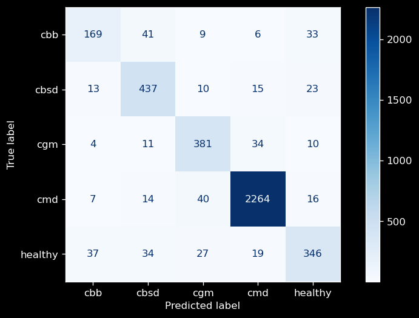
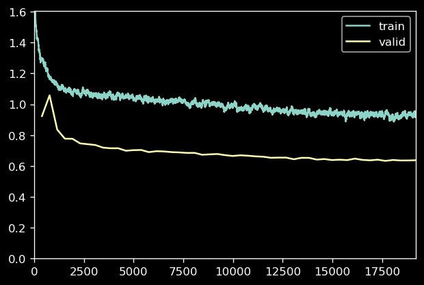

# Cassava Model Metrics Report

Our best model (modified efficientnet b4 with no ensemble) scored with 90% accuracy on our holdout test set.

<br>

```
              precision    recall  f1-score   support

         cbb       0.73      0.66      0.69       258
        cbsd       0.81      0.88      0.84       498
         cgm       0.82      0.87      0.84       440
         cmd       0.97      0.97      0.97      2341
     healthy       0.81      0.75      0.78       463

    accuracy                           0.90      4000
   macro avg       0.83      0.82      0.82      4000
weighted avg       0.90      0.90      0.90      4000
```

CBB or Cassava Bacterial Blight was the hardest for our model to correctly identify. It had a recall score of only 0.66 and an f1 of 0.69.  CBB was also by far the category in which we were given the fewest samples.  In the field, this will have to be taken into account since we are only getting a small percentage of actual CBB correctly classified.

<br>




<br>

---

<br>
<br>

## Kaggle private score

The same model scored 89.48% on the Kaggle private test set.  The highest score on the leaderboard was 91.32%


<br>

------

<br>

## Hyperparameters

There are just so many hyperparameters involved in a project like this and most are not applicable to any other model/optmizer/loss-function/etc. But here are some relevant ones.

Learning Rate: Head: 7e03 , All: 4e-3

Batch Size Actual: 48 , Accumulated: 128

LR Schedule: Flat to 40 percent of epochs and cosine annealing from there.

Weight Decay: 1e-2

Number of Epochs: 1 + 50

<br>

Loss plot:




